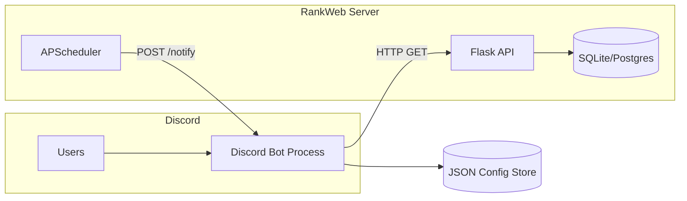

# Design Document: Discord Bot

## Overview

The Discord bot is a separate Python process that connects to Discord via the `discord.py` library and communicates with the existing RankWeb Flask API over HTTP. It enables Discord server members to track song ranking games, receive automatic notifications about stage transitions and deadline reminders, and view game status and results directly in Discord.

The bot uses Discord's slash command system (`/rank <subcommand>`) and maintains per-server configuration (tracked games, notification channel, Ranker role) in a lightweight JSON file store. It exposes a small HTTP endpoint (via `aiohttp`) that the Flask app's APScheduler calls when games transition between stages.



## Architecture

### Process Architecture

The bot runs as a standalone Python process, completely independent of the Flask application. Communication happens in two directions:

1. **Bot → Flask API**: The bot makes HTTP GET requests to existing Flask API endpoints (`/api/game/<game_code>`, `/api/game/<game_code>/songs`) to retrieve game data. No authentication is needed for these read operations since the bot acts as an internal service.

2. **Flask Scheduler → Bot**: When the APScheduler in `tasks.py` detects a stage transition, it POSTs to the bot's HTTP endpoint (`POST /notify`) with the game_code and new stage. The bot then looks up which servers are tracking that game and sends notifications.

### Deployment Model

- The bot runs alongside the Flask app on the same production droplet
- Managed as a systemd service (`rankbot.service`)
- Shares the same `.env` file for configuration (with additional `DISCORD_BOT_TOKEN` and `BOT_NOTIFY_SECRET` variables)
- The Flask process and bot process communicate over localhost HTTP

### Technology Choices

| Component | Choice | Rationale |
|-----------|--------|-----------|
| Discord library | `discord.py` (v2.x) | Mature, async-native, slash command support via `app_commands` |
| HTTP client | `aiohttp` | Already a dependency of discord.py, async-compatible |
| HTTP server (for scheduler) | `aiohttp.web` | Lightweight, runs in the same async loop as the bot |
| Data store | JSON file | Simple, no additional database needed for small config data |
| Scheduler communication | HTTP POST | Decoupled, no shared memory or message queue needed |

## Components and Interfaces

### Module Structure

```
bot/
├── __init__.py
├── main.py              # Entry point, starts bot + HTTP server
├── bot.py               # Discord bot client setup, command tree
├── commands.py          # Slash command implementations
├── notifications.py     # Notification formatting and dispatch
├── api_client.py        # HTTP client for Flask API
├── store.py             # Server config persistence (JSON file)
├── webhook_server.py    # aiohttp server for scheduler callbacks
└── config.py            # Bot configuration from env vars
```

### Key Interfaces

#### `api_client.py` — Flask API Client

```python
class RankWebAPIClient:
    """HTTP client for communicating with the Flask API."""

    async def get_game(self, game_code: str) -> dict | None:
        """Fetch game details. Returns None if game not found."""

    async def get_game_songs(self, game_code: str) -> list[dict]:
        """Fetch songs with stats for a game in DONE stage."""
```

#### `store.py` — Server Configuration Store

```python
@dataclass
class ServerConfig:
    server_id: int
    tracked_games: set[str]         # game_codes
    notification_channel_id: int | None
    ranker_role_id: int | None
    reminders_sent: set[str]        # "{game_code}:{deadline_type}" dedup keys

class ConfigStore:
    """Manages per-server tracking configuration persisted to JSON."""

    def get_config(self, server_id: int) -> ServerConfig: ...
    def track_game(self, server_id: int, game_code: str) -> bool: ...
    def untrack_game(self, server_id: int, game_code: str) -> bool: ...
    def set_channel(self, server_id: int, channel_id: int) -> None: ...
    def set_role(self, server_id: int, role_id: int) -> None: ...
    def mark_reminder_sent(self, server_id: int, game_code: str, deadline_type: str) -> None: ...
    def is_reminder_sent(self, server_id: int, game_code: str, deadline_type: str) -> bool: ...
    def get_servers_tracking(self, game_code: str) -> list[ServerConfig]: ...
    def save(self) -> None: ...
    def load(self) -> None: ...
```

#### `notifications.py` — Notification Formatting

```python
def format_rank_open_notification(game_data: dict, role_mention: str) -> discord.Embed:
    """Format the SUBMIT→RANK transition notification embed."""

def format_results_available_notification(game_data: dict, role_mention: str) -> discord.Embed:
    """Format the RANK→DONE transition notification embed."""

def format_deadline_reminder(game_data: dict, role_mention: str, deadline_type: str) -> discord.Embed:
    """Format a deadline reminder embed."""

def format_results_embed(game_data: dict, songs: list[dict]) -> discord.Embed:
    """Format the results display embed with ranked songs."""

def format_status_embed(games: list[dict]) -> discord.Embed:
    """Format the status display showing all tracked games."""

def format_active_embed(games: list[dict]) -> discord.Embed:
    """Format the active games display (SUBMIT/RANK only)."""
```

#### `webhook_server.py` — Scheduler Callback Endpoint

```python
async def handle_notify(request: aiohttp.web.Request) -> aiohttp.web.Response:
    """
    POST /notify
    Body: {"game_code": "ABC123", "new_stage": "rankings", "secret": "..."}
    Called by the Flask scheduler when a game transitions.
    """
```

#### `commands.py` — Slash Commands

All commands are subcommands of the `/rank` group:

| Command | Parameters | Description |
|---------|-----------|-------------|
| `/rank track` | `game_code: str` | Track a game in this server |
| `/rank untrack` | `game_code: str` | Stop tracking a game |
| `/rank status` | — | Show all tracked games |
| `/rank active` | — | Show active (non-DONE) games |
| `/rank join` | — | Get the Ranker role |
| `/rank leave` | — | Remove the Ranker role |
| `/rank results` | `game_code: str` | Show game results |
| `/rank channel` | `channel: TextChannel` | Set notification channel |

## Data Models

### ServerConfig (JSON persistence)

```json
{
  "servers": {
    "123456789": {
      "server_id": 123456789,
      "tracked_games": ["ABC123", "XYZ789"],
      "notification_channel_id": 987654321,
      "ranker_role_id": 111222333,
      "reminders_sent": ["ABC123:submit", "XYZ789:rank"]
    }
  }
}
```

### Webhook Payload (Scheduler → Bot)

```json
{
  "game_code": "ABC123",
  "new_stage": "rankings",
  "secret": "shared-secret-token"
}
```

### Flask API Response (Game Details)

The bot reads from existing endpoints. Expected shape from `/api/game/<game_code>`:

```json
{
  "id": 1,
  "title": "Summer Jams",
  "status": "submissions",
  "description": "Best summer songs",
  "submissionDueDate": "2025-07-01",
  "rankDueDate": "2025-07-08",
  "gameCode": "ABC123",
  "spotifyPlaylistUrl": "https://open.spotify.com/...",
  "youtubePlaylistUrl": "https://youtube.com/..."
}
```

### Deadline Detection Logic

```python
from datetime import date, timedelta

def is_deadline_approaching(due_date: date, now: date) -> bool:
    """Returns True if due_date is within 24 hours (i.e., tomorrow or today)."""
    delta = due_date - now
    return timedelta(0) <= delta <= timedelta(days=1)
```

### Active Games Filter

```python
ACTIVE_STAGES = {"submissions", "rankings"}

def filter_active_games(games: list[dict]) -> list[dict]:
    """Return only games in SUBMIT or RANK stage."""
    return [g for g in games if g["status"] in ACTIVE_STAGES]
```

## Correctness Properties

*A property is a characteristic or behavior that should hold true across all valid executions of a system — essentially, a formal statement about what the system should do. Properties serve as the bridge between human-readable specifications and machine-verifiable correctness guarantees.*

### Property 1: Track/Untrack Set Semantics

*For any* server and any sequence of track and untrack operations with arbitrary game_codes, the resulting set of tracked games SHALL equal the set of all game_codes that were tracked and not subsequently untracked. Tracking an already-tracked game_code SHALL not change the set, and untracking a game_code not in the set SHALL not change the set.

**Validates: Requirements 1.1, 1.3, 1.4, 1.5, 1.6**

### Property 2: Active Games Filter Correctness

*For any* list of games with arbitrary stages, the active filter SHALL return exactly those games whose stage is SUBMIT or RANK — no DONE games shall appear in the result, and no SUBMIT/RANK games shall be excluded.

**Validates: Requirements 3.1**

### Property 3: Status Display Completeness

*For any* set of tracked games with arbitrary titles, stages, and due dates, the formatted status display SHALL contain every game's title, stage label, and relevant due date.

**Validates: Requirements 2.1**

### Property 4: Stage Transition Notification Completeness

*For any* game with an arbitrary title, rank due date, and optional playlist URLs, the SUBMIT→RANK notification SHALL contain the game title, the rank due date, and all non-null playlist links. *For any* game with an arbitrary title, the RANK→DONE notification SHALL contain the game title and a results-available message.

**Validates: Requirements 5.1, 5.2**

### Property 5: Deadline Proximity Detection

*For any* date `d` and reference date `now`, the deadline check SHALL return true if and only if `0 <= (d - now).days <= 1`. Dates in the past or more than 1 day in the future SHALL return false.

**Validates: Requirements 6.1, 6.2**

### Property 6: Reminder Deduplication

*For any* game and deadline type, after marking a reminder as sent, subsequent checks for the same game and deadline type SHALL report the reminder as already sent, and the marked set SHALL grow by exactly one entry per unique (game_code, deadline_type) pair regardless of how many times it is marked.

**Validates: Requirements 6.3**

### Property 7: Results Embed Completeness

*For any* list of songs with arbitrary titles, artists, and average rank values, the formatted results embed SHALL contain every song's title, artist, and formatted average rank.

**Validates: Requirements 7.1**

### Property 8: Server Config Round-Trip

*For any* valid ServerConfig (with arbitrary server_id, tracked game_codes, channel_id, role_id, and reminders_sent), serializing to JSON and deserializing back SHALL produce an equivalent ServerConfig.

**Validates: Requirements 9.3**

### Property 9: Multi-Server Notification Dispatch

*For any* game_code tracked by N servers (N ≥ 1), when a stage transition event is received for that game_code, the notification dispatch SHALL produce exactly N notification actions — one for each server's configured notification channel.

**Validates: Requirements 10.1, 10.2**

## Error Handling

| Scenario | Handling |
|----------|----------|
| Flask API unreachable | Log error, respond to user with "Unable to reach game server, try again later" |
| Flask API returns 404 for game_code | Respond with "Game not found" error message |
| Bot lacks permission to create/assign roles | Respond with "I need Manage Roles permission" and log warning |
| Bot lacks permission to send in notification channel | Log warning, attempt to DM server owner |
| Invalid webhook secret | Return 403, log attempt |
| Malformed webhook payload | Return 400, log payload shape |
| JSON store file corrupted | Load from backup, or initialize empty state with warning log |
| Discord rate limiting | discord.py handles this automatically with built-in retry |
| Notification channel deleted | Clear stored channel_id, log warning, skip notification |

### Error Response Patterns

All user-facing error responses use Discord ephemeral messages (only visible to the command issuer) to avoid cluttering channels. Notifications that fail to send are logged but do not retry — the next scheduled check will catch up naturally.

## Testing Strategy

### Unit Tests (pytest)

Follows the same conventions as the existing backend tests: pytest with class-based test organization, shared fixtures in `conftest.py`, and mocked external dependencies.

**Test categories:**

- **ConfigStore tests**: Track/untrack set behavior, JSON round-trip serialization, reminder deduplication, multi-server lookups
- **Notification formatting tests**: Embed content for each notification type contains expected fields (title, dates, links)
- **Deadline logic tests**: Boundary cases for `is_deadline_approaching` (today, tomorrow, past, far future)
- **Command handler tests**: Each slash command's success and error paths with mocked API client and Discord interactions
- **API client tests**: Mocked HTTP responses (200, 404, connection error) using `aiohttp` test utilities or `unittest.mock`
- **Webhook endpoint tests**: Valid/invalid secret, malformed payload, correct notification dispatch

### Integration Tests

- Webhook endpoint receives POST and triggers correct notification dispatch (using `aiohttp.test_utils`)
- Flask API client handles real HTTP responses (run against test Flask server)

### Test File Structure

```
tests/
├── bot/
│   ├── conftest.py             # Bot test fixtures (mock store, mock API client)
│   ├── test_store.py           # ConfigStore unit tests
│   ├── test_notifications.py   # Notification formatting tests
│   ├── test_commands.py        # Slash command handler tests
│   ├── test_api_client.py      # API client tests with mocked HTTP
│   ├── test_deadline.py        # Deadline detection logic tests
│   └── test_webhook.py         # Webhook endpoint integration tests
```

Tests run via the existing CI pipeline (`pytest tests/ -v`), which automatically picks up the `tests/bot/` subdirectory.
